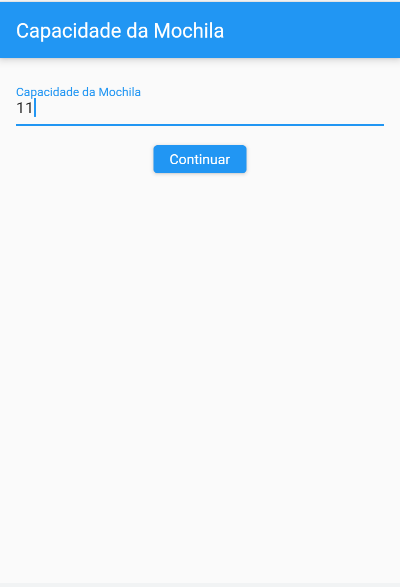
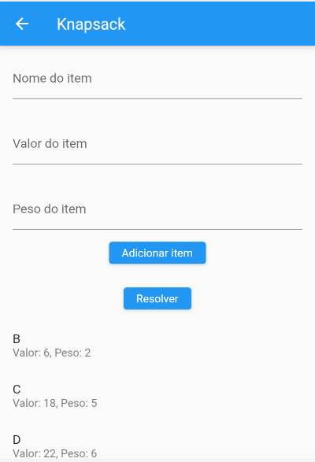
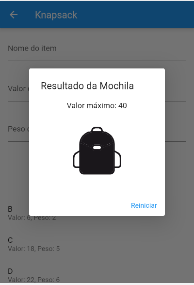

# PD_knapsack_app

**Número da Lista**: 4 
**Conteúdo da Disciplina**: Programação Dinâmica 

## Alunos
|Matrícula | Aluno |
| -- | -- |
| 14/0158278  |  Pedro Helias Carlos |
| 17/0069991	 |  João Victor Max Bisinotti de Oliveira |

## Sobre

O algoritmo da mochila em programação dinâmica é um método eficiente para resolver o problema de selecionar itens de uma lista para preencher uma mochila com capacidade limitada, visando maximizar o valor total dos itens selecionados. Ele divide o problema em subproblemas menores, armazenando soluções intermediárias em uma matriz para calcular o valor máximo para diferentes capacidades da mochila e subconjuntos de itens. Isso resulta em uma abordagem eficiente e escalável para resolver o problema clássico da mochila.

## Screenshots

## Instalação
**Linguagem**: Dart 
**Framework**: Flutter 

1. Instale o Flutter em seu computador seguindo os passos descritos na documentação oficial: https://flutter.dev/docs/get-started/install
2. Clone o repositório do projeto em sua máquina
3. Execute o comando `flutter pub get` no diretório raiz do projeto para instalar as dependências necessárias
4. Conecte seu dispositivo móvel ao computador ou inicie um emulador de dispositivo móvel ou selecione o navegador(Chrome(web)) como Flutter Device.
5. Execute o comando `flutter run` no diretório raiz do projeto para iniciar o aplicativo

## Uso
A tela inicial permite que o usuário entre com a capacidade da mochila (número inteiro que representa o peso que ela aguenta). Na página seguinte é possível inserir os itens com nome, valor e peso. Por último, na o usuário clica no botão 'Resolver' e obtém o maior valor possível com os itens inseridos.
